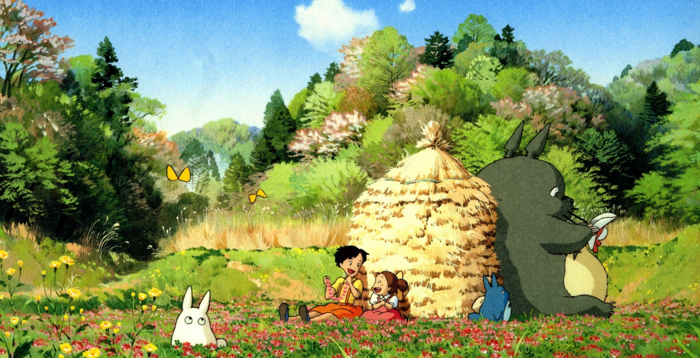

# Alice's Commlab Page for 25Fall

SEE MY RENDERED WEB WORK [BELOW]( https://aaaaaalice2206.github.io/CommLab/)

These are the weekly exerciese I did in class:
* [back-to-dorm](back-to-dorm)
* [tutorial](tutorial)
* [lorem](lorem)

And also here are some in-class exercises I did to test out the functions of some code in both CSS and HTML:
* [css-layout1](css-layout1)
* [css-layout2](css-layout2)
* [css-tests](css-tests)


Here is a link to [shanzhai-web](shanzhai-web), which is the very first big project I made using both HTML and CSS.


I learned this CSS in class this month which allows me to format the link to make it appear prettier. 

It is the very first function I succeeded in formatting in the shanzhai web project:
```css
a.scarrd-link{
    font-weight: bold;
    font-size: 25px;
    color: white;
    margin-top: 50px;
    display: inline-block;
    padding: 10px 20px;
    border: 2px solid white;
    border-radius: 5px;
    transition: background-color 0.3s, box-shadow 0.2s;
    position: relative;
    margin-bottom: 200px;
}
```

To be honest, as a "computer idiot", I never imagined that I can create websites by myself in the past O(∩_∩)O

Hope I will make greater progress and be better at coding in the days to come :)




