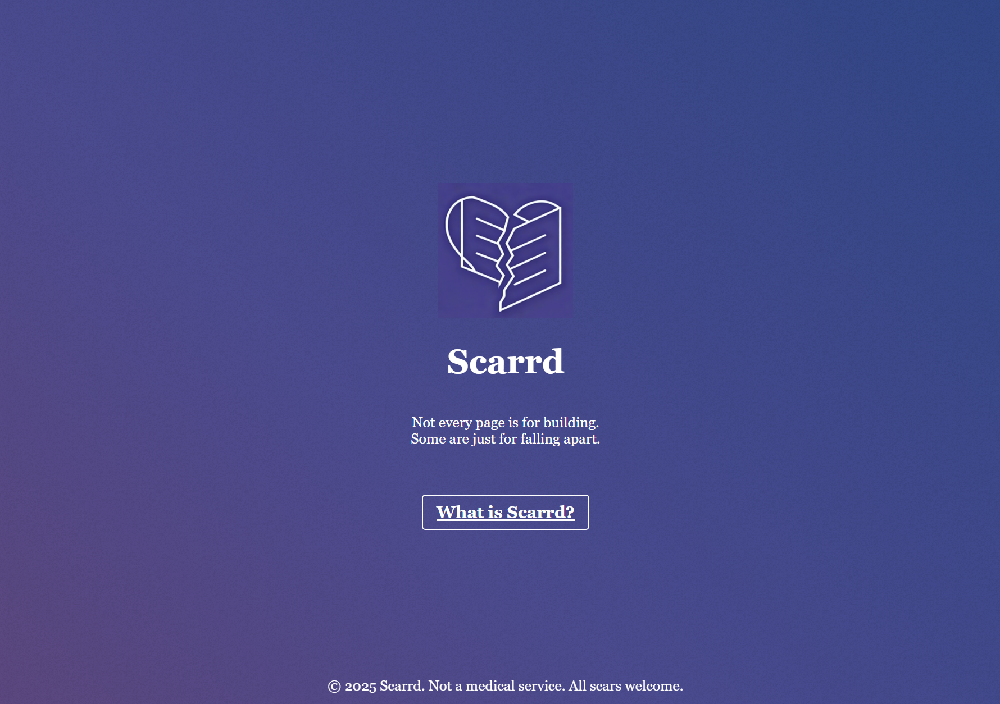
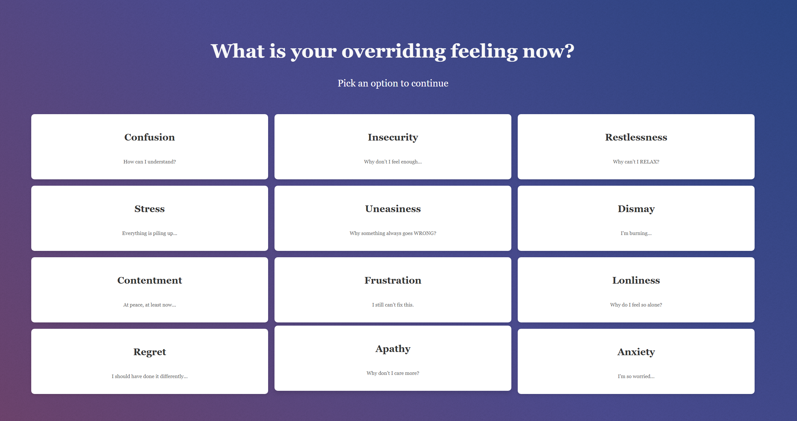

# Scarrd

### Where Simplicity Meets Raw Emotion

**Scarrd** reimagines the simplicity of [Carrd](https://carrd.co/) with an emotional twist. It’s not just a website, it’s a place where users' feelings take center stage.

---

## Abstract  
In a world where most tutorials and templates guide us to create polished, perfect websites, **Scarrd** dares to challenge this norm. Inspired by the clean and minimalist design of Carrd, **Scarrd** adds a layer of vulnerability and emotion, which invites users to build not just one-page sites, but spaces that breathe with raw and unfiltered human experiences. Imagine a website that doesn’t just reflect your thoughts but embodies your feelings, where pages are no longer just a design, but canvases for your emotional journey. **Scarrd** empowers users to explore the intersection of design and emotion by transforming simple web pages into personal and vivid expressions of the self. Welcome to a space where your feelings can break free!

---

## Preview

  
*A minimalist design with a story of emotion.*

  
*Pick your overriding feeling and tailor solutions for healing!*

---

## How to Try It Out  
- Visit [Scarrd](https://aaaaaalice2206.github.io/CommLab/shanzhai-web/shanzhai-web/) to start building your emotional space.
- Choose a starting point, but don’t just focus on the design. Let your feelings guide you.
- Feel free to express your worries and concerns in the pages and DIY your own *Scarrd* !

---

## About the Creator  
*Alice Guo*  

An ENFP and a Communications Lab Web Design Fall 2025 student at NYU Shanghai. As an extremely extroverted and highly feeling-driven individual, she was inspired to create Scarrd—a website that allows raw emotions to take center stage. A complete beginner in web design as she is, this project has been a journey of learning, and she’s excited to keep growing. She hopes users will be patient as she refines her skills and improves the project.

Find more of her work at her [GitHub Profile](https://aaaaaalice2206.github.io/CommLab/)!
